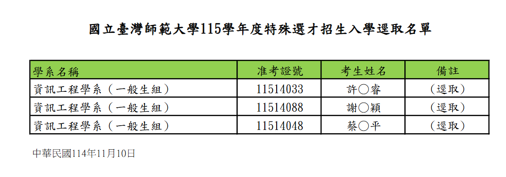

## 為啥想報台師大

因為想要練面試，阿因為我沒有像 charhao 那樣是中字輩殺手，所以我覺得中字輩會把我刷掉

到最後就學 tw87 投一間師大來練面試

## 備審

報名費 $800$ 好貴

這個等特選完後再放，我怕我被ㄍㄠㄑ一ˊ一ㄡ

<!-- `F@3LVHuxQz` 這是我的師大密碼，丟上來只是提醒大家不要忘記自己的密碼

不然找密碼要好久喔

<embed src="../assets/pdf/自我介紹.pdf" type="application/pdf" />

上面這個是我的備審，大家可以參考一下，雖然我也是參考其他人的
-->

## 面試

公布面試名單的那幾天好像有颱風

要跑去台北面試還要跟颱風單挑，真的很刺激

但

逕取了，沒面試到

## 最後成績

