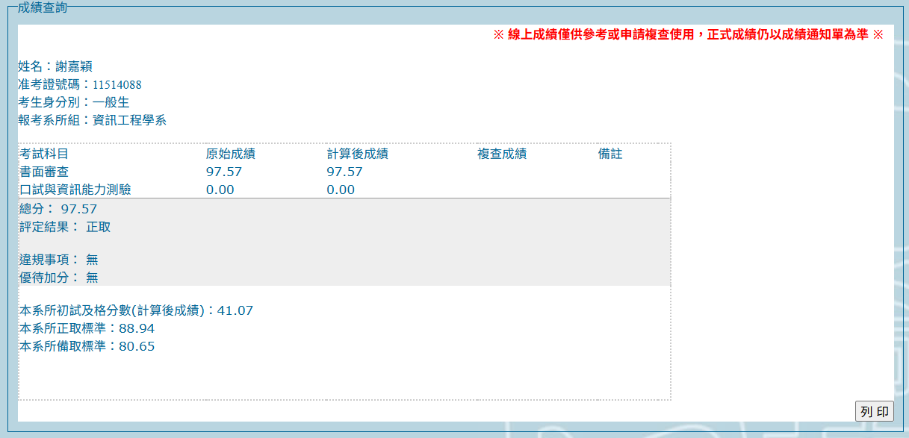



## 備審

報名費 $800$ 好貴

`F@3LVHuxQz` 這是我的師大密碼，丟上來只是提醒大家不要忘記自己的密碼

不然找密碼要好久喔

<!-- <embed src="../assets/pdf/自我介紹.pdf" type="application/pdf" /> -->

<!-- 上面這個是我的備審，大家可以參考一下，雖然我也是參考其他人的 -->

<!-- 阿裡面有一些打錯的字，希望大家不要計較(我不想要變成下一個高齊優) -->

## 面試

逕取了，沒面試到

